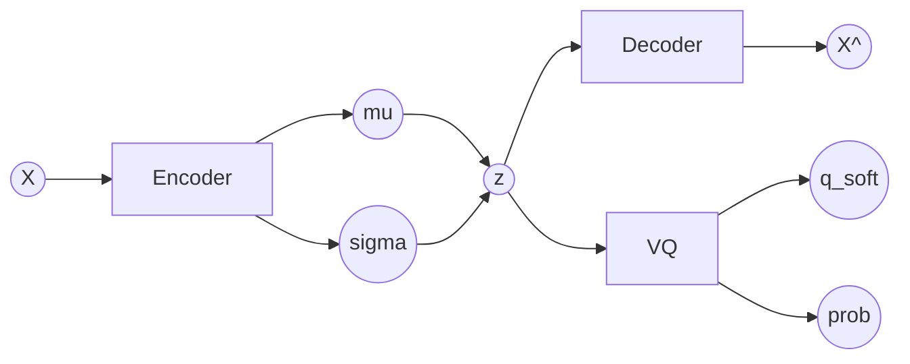
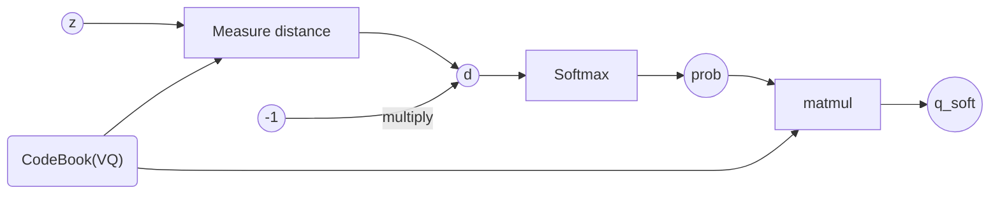

# Soft VQ VAE Clustering

微分可能な VQ VAE クラスタリング

## 目的

- 微分グラフをつなぐこと
- Code Book (Quantizing Vectors)を更新しやすくする
- より良い`Vモデル`の開発

## アーキテクチャ

- overall



- VQ (Vector Quantizing) layer



### Loss function

Note: `sg` is short ver of `stop gradient`.

- Reconstruction Error (required)
  $$
  \\bold{Df:} \\ ||X-\\hat{X}||^2_2
  $$
- Quantizing Error (required)
  $$
  \\bold{Df:} \\ ||\\textmd{sg}\[z\] - \\vec{q}\_{soft}||
  $$
- KL divergence (required?)
  $$
  \\bold{Df:} \\ \\frac{1}{2}(-2\\textmd{ln}\\ \\sigma + \\mu^2 + \\sigma^2 -1)
  $$
  - For implementation
    $$ \\frac{1}{2}(-logvar + \\mu^2 + exp(logvar) -1)$$
- Reconstruction Quantizing Error (optional)
  $$
  \\bold{Df:} \\ ||X- \\textmd{Decoder}(\\textmd{sg}\[\\vec{q}\_{soft}\])||^2_2
  $$

#### Reference

https://qiita.com/nishiha/items/2264da933504fbe3fc68

### Metrics

- Reconstruction Error
  小さいほど良いです。
- Quantizing Error
  小さいほど良いです。
- Reconstruction Quantizing Error
  小さいほど良いです。Reconstruction Error と大きく異なる場合は注意が必要です。
- CodeBook 使用率
  量子化ベクトルのうち、全データセットを使ってそれぞれに割り当てられた数をヒストグラムにします。そして、全体の内使われていないベクトルの存在割合を計算します。
- Reconstruction Image
  再構成した画像をいくつか記録します。
- Reconstuction Quantizing Image
  量子化ベクトルから再構成した画像をいくつか記録します。

## To Do

1. モデルを作成する
2. CIFAR10, MNISTなどの分類データセットで学習する
3. 学習途中のLoss, Metricsの値を記録する
4. 様々な困難を乗り越える。
5. 実験完了

### 調査項目

- Code Book使用率とヒストグラム
- Reconstructed Quantizing Imageの取得
- その他、プロトンが面白いと思った現象

## Tips

- Softmax with temperature
  温度$t$が高いほど、緩やかな確率分布になります。
  逆に小さいほど`onehot`分布に近づきます。
  $$
  Softmax\_{withTemp}(\\vec{v}, t) \\ | \
  \\bold{Df}: \\frac{exp(\\frac{\\vec{v}}{t})}
  {\\sum{{exp(\\frac{\\vec{v}}{t})}}}
  $$

- Stop Gradient(PyTorch)
  `torch.Tensor`の`detach()`メソッドを呼ぶことで勾配を消し、微分グラフを切ることができます。

  ```py
  tnsr: torch.Tensor # with grad
  >>> tnsr.grad
  tensor([...])
  >>> tnsr_no_grad = tnsr.detach()
  >>> tnsr_no_grad
  None
  ```

- Sqrt $\\sqrt{}$ Operation sometimes causes *Gradient explosion*.
  平方根による演算は、入力が $0$ の時に微分係数が無限に発散します。
  従って、`ReLU`関数など0の値を取りやすい関数と組み合わせる時は、注意が必要です。
  また、この調査では`距離`を計算する時にユークリッド距離を使用しますが、こういった観点から`二乗距離(Squared distance)`を用いることを推奨します。

  

- KL Loss >> Reconstruction Loss
  KL Lossは通常Reconstruction Lossよりも非常に大きい値を取ります。
  Reconstruction Lossを大きくScaleすることを強く推奨します。
